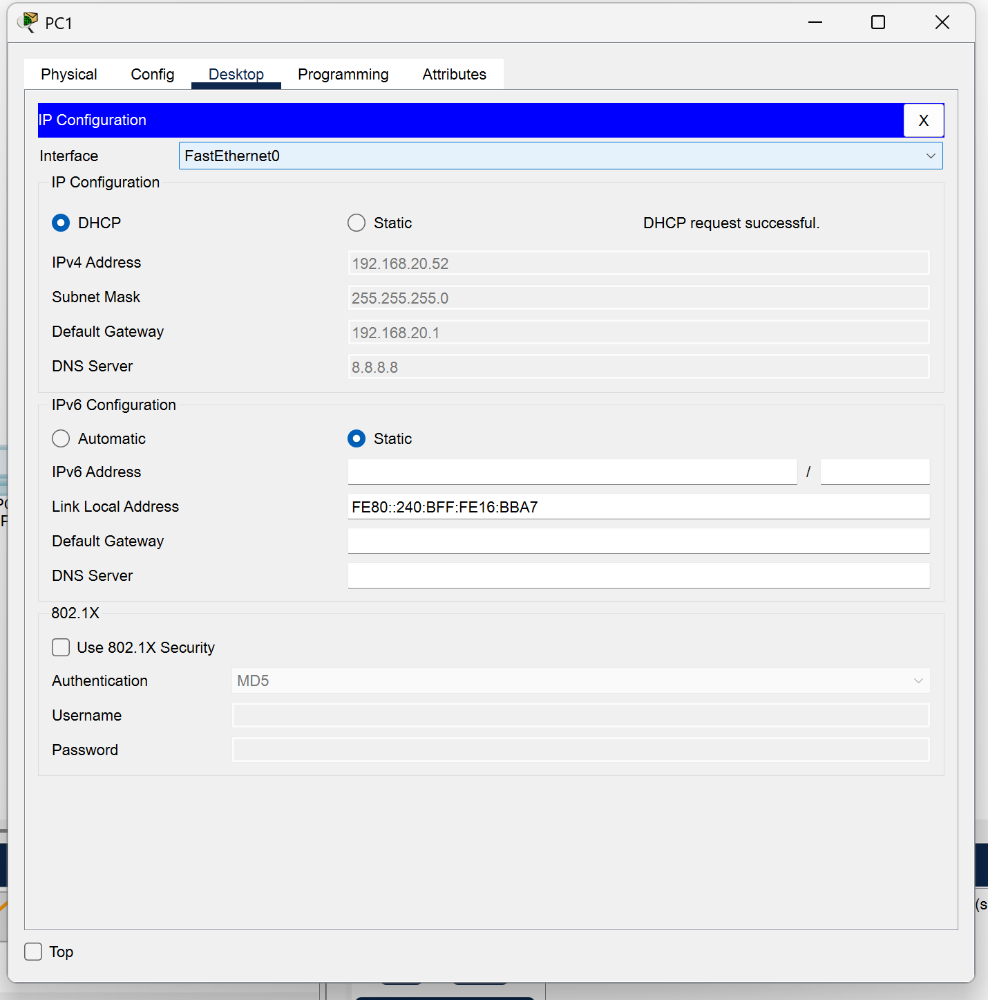
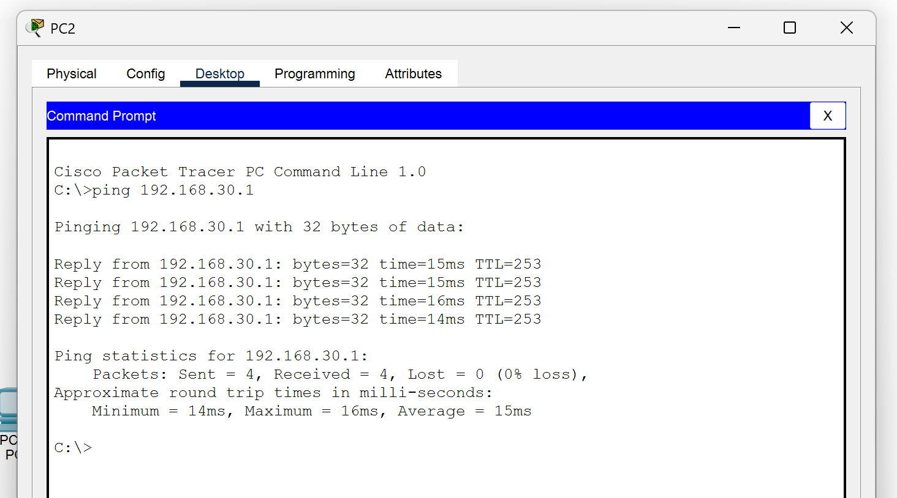
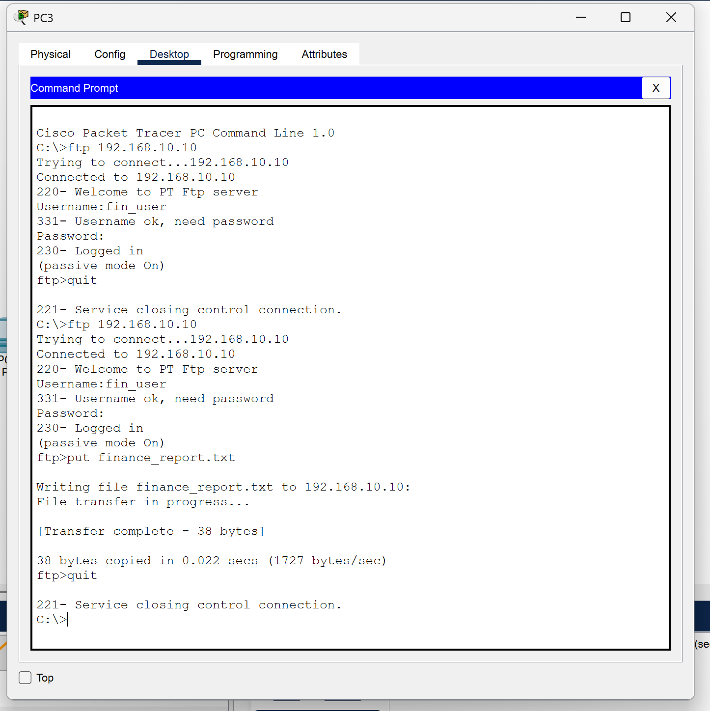
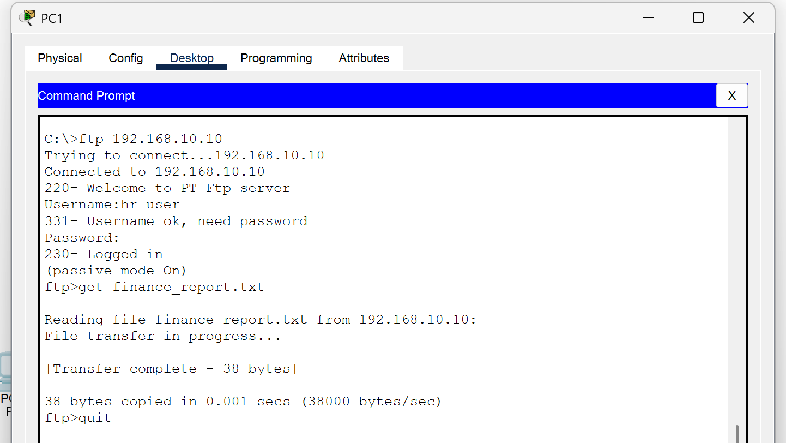

# **Project Report: Centralised File-Sharing System with DHCP & FTP Server**

### **1. Abstract**

This project demonstrates the design and implementation of a scalable, centralised enterprise network connecting three distinct departments: IT, HR, and Finance. The primary objective was to establish a communication backbone that supports automatic IP assignment and secure file sharing across separate subnets. The network topology was simulated using Cisco Packet Tracer, utilizing three Cisco 4321 routers connected via high-speed serial WAN links. Key networking protocols implemented include Static Routing for inter-departmental connectivity, Dynamic Host Configuration Protocol (DHCP) for automated client addressing, and File Transfer Protocol (FTP) for centralised document management. A significant technical challenge addressed in this project was the limitation of broadcast domains; this was overcome by configuring DHCP Relay Agents (`ip helper-address`) on remote routers, allowing a single server in the IT department to service all subnets. The final implementation successfully verified full connectivity via ICMP (Ping), correct IP allocation across all departments, and authenticated file uploads and downloads, fulfilling the organization's requirement for a logical, segmented, yet interconnected digital environment.

### **2. Introduction**

In modern enterprise environments, efficient data management and seamless connectivity are paramount. As organizations expand into multiple departments, the need for logical network segmentation becomes critical to manage traffic flow and enhance security. However, this segmentation introduces challenges in resource sharing, specifically in how devices discover network services and access centralized repositories. This project explores the implementation of a Hub-and-Spoke network architecture designed to resolve these challenges. By centralizing core services—specifically DHCP and FTP—within a primary IT infrastructure, organizations can reduce hardware costs and administration overhead. Instead of deploying separate servers for every department, a single robust server manages addressing and storage for the entire organization. This report details the technical steps required to bridge distinct Local Area Networks (LANs) using Layer 3 routing devices. It covers the configuration of WAN protocols, the necessity of static routing tables to define traffic paths, and the application layer services that enable end-users to perform their daily tasks. The project serves as a microcosm of real-world corporate network design, highlighting the interplay between physical topology and logical configuration.

### **3. Problem Statement**

The scenario provided involves a single-office organization divided into three functional departments: IT, HR, and Finance. Each department operates within its own isolated subnet to ensure logical separation and traffic management. However, this isolation presents a connectivity problem: devices in HR and Finance cannot communicate with the IT infrastructure or each other by default. Furthermore, manually assigning IP addresses to every workstation is inefficient and prone to human error, necessitating an automated solution. The specific requirements include the deployment of a centralized FTP server located solely within the IT department, which must be accessible to authenticated users from all other subnets. A major technical hurdle is that DHCP requests are broadcast packets, which routers automatically discard to prevent network flooding. Consequently, clients in HR and Finance cannot obtain IP addresses from the central IT server without specific router reconfiguration. The project requires a solution that establishes static routes to enable inter-subnet traffic and implements DHCP relaying to forward broadcast requests across WAN links, ensuring all users have seamless access to the shared resources.

### **4. Methodology**

**4.1 Network Topology & Design**
The network was designed using a star-like topology (Hub-and-Spoke). The IT Router (`R-IT`) acts as the central hub, connected via Serial WAN links to two spoke routers: HR (`R-HR`) and Finance (`R-Finance`). Each router services a local Gigabit Ethernet LAN containing Cisco 2960 switches and end devices. The addressing scheme utilizes `192.168.10.0/24` for IT, `192.168.20.0/24` for HR, and `192.168.30.0/24` for Finance, with `/30` subnets for the WAN links to conserve address space.

**4.2 Configuration Strategy**
The configuration process was executed in three phases. First, basic connectivity was established by assigning IP addresses to router interfaces and setting clock rates on DCE serial interfaces. Second, connectivity was enabled using Static Routing. `R-IT` was configured with specific routes to HR and Finance, while the spoke routers were configured with "Gateway of Last Resort" (Default Routes) pointing back to IT. Finally, the IT Server was configured with three distinct DHCP pools. To facilitate IP assignment across routers, the `ip helper-address` command was applied to the LAN interfaces of the HR and Finance routers, converting broadcast requests into unicast packets directed at the server.

**4.3 CLI Implementation**
Key Command Line Interface (CLI) instructions included:

* **Static Routing (R-IT):** `ip route 192.168.20.0 255.255.255.0 10.1.1.2`
* **Default Routing (R-HR):** `ip route 0.0.0.0 0.0.0.0 10.1.1.1`
* **DHCP Relay (R-Fin):** Inside `interface g0/0/0`, the command `ip helper-address 192.168.10.10` was critical for forwarding DHCP discover messages.

### **5. Result and Interpretation**

#### **Figure 1: DHCP Allocation Verification**

**Interpretation:**
The screenshot above confirms that the DHCP Relay Agent is functioning correctly. The HR PC, located on a different subnet from the server, successfully obtained an IP address, Subnet Mask, and Default Gateway. This proves that the router successfully forwarded the broadcast request across the WAN link to the IT Server.

---

#### **Figure 2: Inter-Departmental Connectivity (Ping Test)**

**Interpretation:**
This image demonstrates successful ICMP replies between the HR and Finance departments. The presence of "Reply from..." messages indicates that the static routing tables are correctly configured on all routers, allowing packets to traverse the central IT router to reach their destination.

---

#### **Figure 3: FTP Service Verification**

**Interpretation:**
The final test validates the application layer. The screenshot shows a user from the Finance department successfully logging into the FTP server (`192.168.10.10`) using their credentials. The successful transfer of a text file confirms that the server is reachable, authentication is active, and file permissions are correctly set.

### **6. Conclusion**

The "Centralised File-Sharing System with DHCP & FTP Server" project successfully met all design objectives. By implementing a routed network topology, we achieved logical isolation between departments while maintaining necessary interconnectivity. The deployment of a centralized DHCP server with multiple address pools significantly simplified network management, eliminating the need for manual IP configuration on client devices. The use of DHCP Relay Agents proved to be a vital component in supporting this centralized architecture. Furthermore, the FTP server was successfully deployed, allowing for secure, authenticated file transfer between departments. This project highlights the importance of routing protocols in bridging separate networks and demonstrates how core network services can be scaled efficiently. Future enhancements could include the implementation of Access Control Lists (ACLs) to restrict specific traffic between HR and Finance for tighter security, or the introduction of dynamic routing protocols like OSPF for better redundancy in case of a link failure.

### **7. References**

[1] CompTIA Network+ N10-008 Certification Guide by Glen D. Singh, 2nd Edition, Packt publication.

[2] Cisco Systems, "Configure DHCP Relay Agent on a Cisco Router," *Cisco.com*, 2023. [Online]. Available: [https://www.cisco.com/c/en/us/support/docs/ip/dynamic-address-allocation-resolution/27470-100.html](https://www.cisco.com/c/en/us/support/docs/ip/dynamic-address-allocation-resolution/27470-100.html).

[3] J. F. Kurose and K. W. Ross, *Computer Networking: A Top-Down Approach*, 7th ed. Hoboken, NJ: Pearson, 2017.

[4] R. Perlman, *Interconnections: Bridges, Routers, Switches, and Internetworking Protocols*, 2nd ed. Reading, MA: Addison-Wesley, 2000.

[5] T. Lammle, *CCNA Certification Study Guide, Volume 2: Exam 200-301*. Indianapolis, IN: Sybex, 2020.
