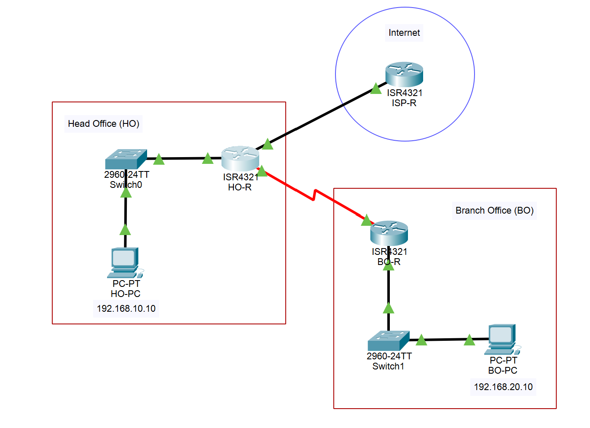
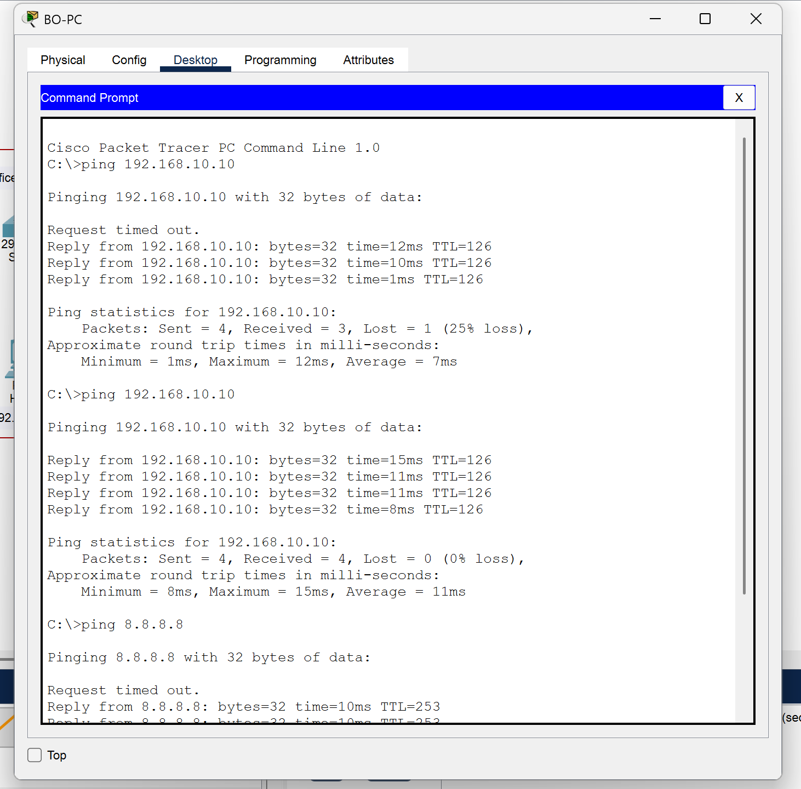
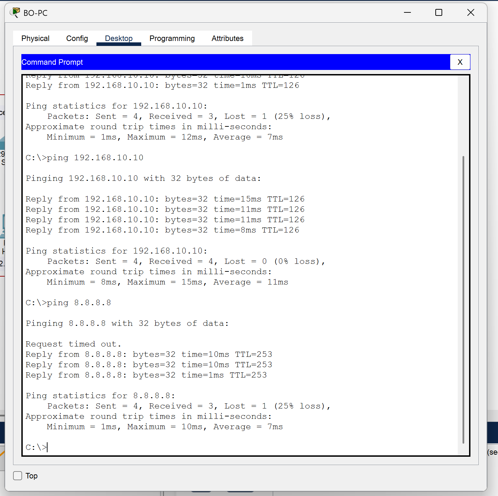
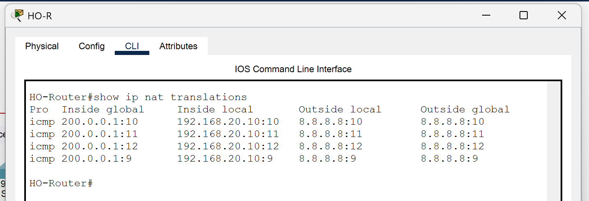

# Project Report: Multi-Branch Corporate Office Network Design

### 1. Abstract

This project details the design, simulation, and implementation of a scalable Multi-Branch Corporate Office Network using Cisco Packet Tracer. In modern enterprise environments, seamless connectivity between geographically dispersed locations—such as a Head Office (HO) and Branch Office (BO)—is critical for operational efficiency. This project addresses this need by establishing a robust Wide Area Network (WAN) using Cisco 4321 Integrated Services Routers interconnected via Serial WAN links. The network architecture utilizes Variable Length Subnet Masking (VLSM) to maximize IP addressing efficiency, assigning /30 subnets for WAN links and /24 subnets for LAN segments. Key technical objectives include the configuration of Static Routing to ensure reliable inter-branch communication and the implementation of Port Address Translation (PAT) to facilitate shared, secure Internet access through a single public IP address. The simulation results validate the network's functionality, demonstrating successful end-to-end connectivity (ICMP pings) between departments and effective translation of private internal IP addresses to the public network. The final design provides a scalable foundation capable of accommodating future departmental growth without significant infrastructure overhaul.

### 2. Introduction

In the current era of digital transformation, the network infrastructure serves as the backbone of any corporate entity. For organizations operating across multiple locations, the ability to maintain unified communication and shared resource access is paramount. This project focuses on the simulation of a corporate network scenario where a company requires reliable interconnection between its Head Office (HO) and a remote Branch Office (BO). The simulation environment, Cisco Packet Tracer, allows for the risk-free modeling of complex networking protocols before physical deployment.

The scope of this project encompasses the end-to-end setup of a network infrastructure that supports data transmission, internet connectivity, and scalability. The design prioritizes industry-standard practices, including the separation of LAN and WAN traffic and the use of Network Address Translation (NAT) to conserve public IPv4 space. By simulating the role of an Internet Service Provider (ISP) and configuring enterprise-grade routers and switches, this project replicates real-world challenges such as routing loops, IP conflict management, and security boundaries. The successful completion of this network ensures that employees at the branch office have the same access to digital resources and the internet as those at the headquarters.

### 3. Problem Statement

The primary challenge addressed in this project is the design of a cohesive network infrastructure for an organization fragmented into disparate locations. A company operating with a Head Office and a Branch Office currently faces "network silos," where communication is restricted to local LANs, preventing collaboration and resource sharing across the enterprise. Furthermore, the organization lacks a centralized and secure method for accessing the Internet; individual internet connections for every device are cost-prohibitive and insecure.

The problem requires a solution that bridges the WAN gap while adhering to strict technical constraints. First, the addressing scheme must be efficient; wasting IP addresses is not acceptable in a scalable environment. Second, the routing architecture must be robust enough to direct traffic accurately between the HO and BO without manual intervention for every packet. Third, the network must support "Overloading" or Port Address Translation (PAT), allowing hundreds of internal private users to share a single expensive Public IP address provided by the ISP. Finally, the design must be forward-looking, ensuring that the addition of new departments or branches in the future does not require a complete redesign of the network topology.

### 4. Methodology

The implementation of the network followed a structured, multi-phase lifecycle approach within the Cisco Packet Tracer 8.x environment.

**Topology Design:** The physical layer was constructed using two Cisco 4321 Routers (HO and BO) equipped with NIM-2T serial modules for WAN connectivity, and one router acting as the ISP. Cisco 2960 switches were deployed to manage the LAN segments, connecting to end-user PCs via Ethernet.

**IP Configuration Strategy:** A VLSM scheme was applied. Private Class C addresses (`192.168.10.0/24` and `192.168.20.0/24`) were assigned to the LANs for high scalability, while efficient `/30` subnets were used for the router-to-router links to minimize address wastage.

**Routing and PAT Implementation:** Connectivity was established using Static Routing. A default route (`0.0.0.0 0.0.0.0`) was configured on the Branch router pointing to the Head Office, while the Head Office router was configured with specific routes to the Branch and a default route to the ISP. Security and internet access were achieved by configuring Port Address Translation (PAT) on the Head Office router. An Access Control List (ACL) was created to define permitted internal traffic, which was then overloaded onto the ISP-facing Gigabit interface, allowing private hosts to communicate with the public internet simulation.

### 5. Result and Interpretation

The validation phase of the project confirmed that all design objectives were met successfully.

---

#### **Topology Visualization**

**Interpretation:**
The topology diagram illustrates the successfully cabled network, with all link lights (triangles) showing green, indicating active Layer 1 and Layer 2 connectivity across LAN and WAN segments.

---

#### **Connectivity Testing (Ping)**

**Interpretation:**
The successful ICMP Echo Replies demonstrate that the Static Routing configuration is functioning correctly, allowing packets to traverse the WAN link. Furthermore, the successful ping to `8.8.8.8` confirms that the default gateway and ISP routing paths are valid.

---

#### **NAT Verification**

**Interpretation:**
The NAT translation table provides technical proof of the PAT configuration. The "Inside Local" column shows the private source IP (e.g., `192.168.20.10`), while the "Inside Global" column shows it successfully translated to the public IP (`200.0.0.1`) utilizing unique port numbers (e.g., `:1024`), confirming that internal hosts are masked from the public internet.
### 6. Conclusion

In conclusion, this project successfully delivered a fully functional Multi-Branch Corporate Office Network that adheres to modern networking standards. By effectively utilizing Cisco Packet Tracer, we demonstrated that a Head Office and Branch Office could be securely interconnected using Serial WAN links and Static Routing. The implementation of VLSM ensured that the IP addressing scheme remained efficient yet scalable, leaving ample room for the addition of future departments or branches.

The critical requirement of shared Internet access was resolved through the configuration of Port Address Translation (PAT), which not only provided connectivity but also added a layer of security by hiding internal network structures from the public internet. The testing phase verified robust performance with zero packet loss in inter-branch communications. This project highlights the importance of hierarchical network design and serves as a scalable blueprint for small-to-medium enterprise (SME) network deployments. Future enhancements could include the implementation of dynamic routing protocols like OSPF for automated failover and the introduction of VLANs for better traffic segmentation.

### 7. References

[1] T. Lammle, *CCNA Certification Study Guide, Volume 2: Exam 200-301*, 1st ed. Indianapolis, IN: Sybex, 2020.

[2] W. Odom, *CCNA 200-301 Official Cert Guide, Volume 1*, 1st ed. Cisco Press, 2019.

[3] Cisco Systems, "IP Addressing and Subnetting for New Users," Cisco.com, 2023. [Online]. Available: [https://www.cisco.com/c/en/us/support/docs/ip/routing-information-protocol-rip/13788-3.html](https://www.cisco.com/c/en/us/support/docs/ip/routing-information-protocol-rip/13788-3.html).

[4] Cisco Systems, "Configuring Network Address Translation: Getting Started," Cisco.com, 2023. [Online]. Available: [https://www.cisco.com/c/en/us/support/docs/ip/network-address-translation-nat/13772-12.html](https://www.cisco.com/c/en/us/support/docs/ip/network-address-translation-nat/13772-12.html).

[5] J. Kurose and K. Ross, *Computer Networking: A Top-Down Approach*, 7th ed. Pearson, 2017.
