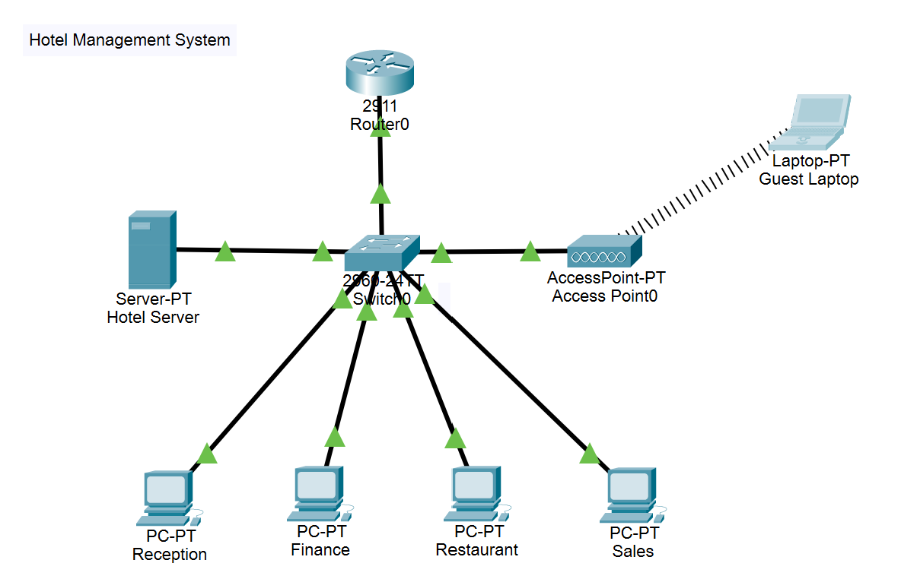
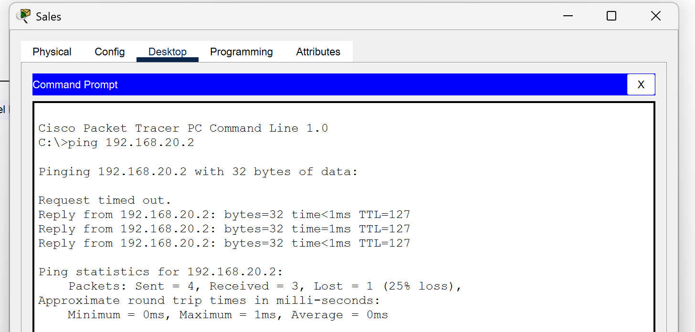
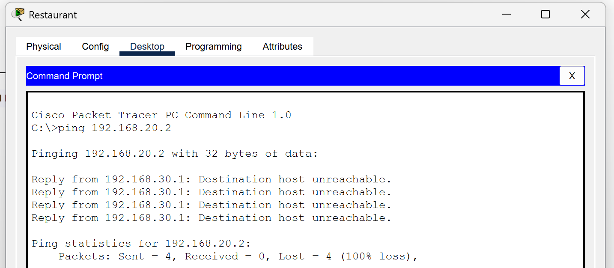
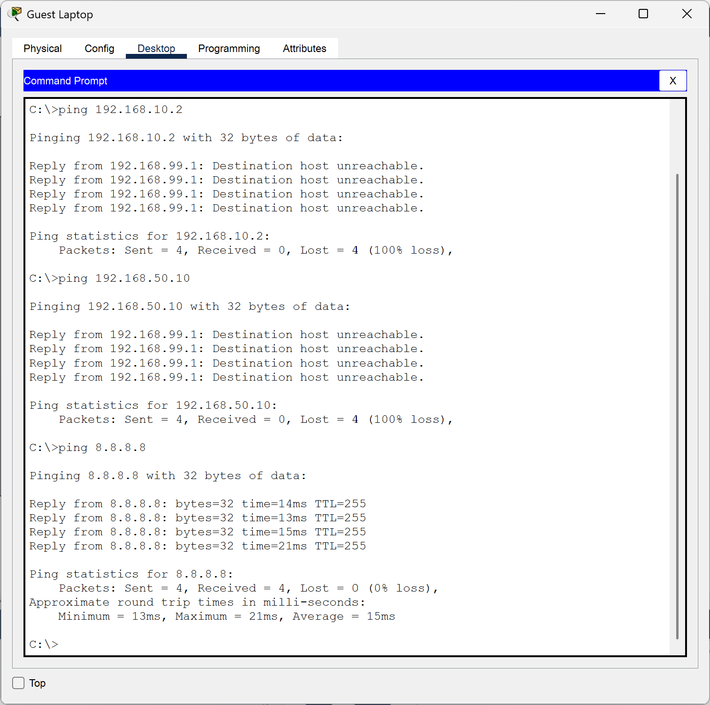

# **Project Report: Secure Hotel Management Network Design**

### **1. Abstract**

This project presents the design and simulation of a secure, segmented network infrastructure for a large hotel environment using Cisco Packet Tracer. Modern hospitality networks require robust separation between guest services and mission-critical administrative operations to ensure data privacy and network stability. This study implements Virtual Local Area Networks (VLANs) to isolate traffic across four distinct departments—Reception, Finance, Restaurant, and Sales—along with a dedicated Guest Wi-Fi network and a central file server. Inter-departmental communication and security policies are enforced using a "Router-on-a-Stick" topology and Extended Access Control Lists (ACLs). Specifically, strict security measures are applied to the Finance department to prevent unauthorized access, while Guest access is restricted solely to the Internet, effectively isolating them from the internal enterprise network. The simulation demonstrates the successful implementation of VLAN segmentation, DHCP automation, and ACL-based traffic filtering, proving the viability of this architecture for real-world deployment in the hospitality sector.

---

### **2. Introduction**

The hospitality industry relies heavily on efficient network infrastructure to manage daily operations, guest services, and back-office administration. A single, flat network is no longer sufficient due to security risks and broadcast traffic congestion. This project focuses on designing a hierarchical network for a multi-departmental hotel that prioritizes security and performance. The primary challenge addressed is the need to allow seamless connectivity for guests while strictly protecting sensitive corporate data, such as financial records and guest databases.

The network integrates essential technologies including VLANs for logical segmentation, DHCP for dynamic addressing, and Access Control Lists (ACLs) for granular traffic engineering. By simulating this environment in Cisco Packet Tracer, we model real-world scenarios such as restricting guest access to internal resources and securing sensitive financial data. The resulting infrastructure provides a scalable, secure, and efficient communication backbone that meets modern enterprise standards for reliability and information security.

---

### **3. Problem Statement**

A large hotel comprises multiple functional departments—Reception, Finance, Restaurant, and Sales—each generating distinct network traffic with varying security requirements. In a traditional unsegmented network, sensitive financial data is vulnerable to internal unauthorized access or external threats via the guest network. Furthermore, guest Wi-Fi access, if not properly isolated, poses a significant security risk to the hotel’s internal servers and administrative terminals.

The core problem addressed in this project is the design of a network that simultaneously provides open Internet access to guests while enforcing strict isolation of internal resources. Specific challenges include:

1. **Logical Isolation:** Ensuring traffic from different departments does not mix without authorization.
2. **Access Control:** Implementing rules where only Management (Sales) can access Finance, while blocking all other departments.
3. **Guest Security:** Preventing guests from accessing the internal server or any department LAN while maintaining Internet connectivity.
4. **Centralized Management:** Providing a central server accessible only to authorized staff.
Addressing these problems requires a robust implementation of Layer 2 VLAN tagging and Layer 3 routing policies.

---

### **4. Methodology**

The network was designed and simulated using Cisco Packet Tracer. The methodology followed a three-tiered approach: Topology Design, Configuration, and Security Implementation.

**A. Topology Design:**
A Star Topology was utilized, centered around a Cisco 2960 Switch and a Cisco 2911 Router. Five VLANs were created: VLAN 10 (Reception), VLAN 20 (Finance), VLAN 30 (Restaurant), VLAN 40 (Sales), and VLAN 50 (Server), plus VLAN 99 for Guest Wi-Fi. An Access Point provided wireless connectivity for guests.

**B. Configuration:**
Layer 2 configuration involved assigning switch ports to specific VLANs and configuring a Gigabit Trunk link (802.1Q) to the router. Layer 3 configuration utilized "Router-on-a-Stick" with sub-interfaces (e.g., g0/0.10, g0/0.20) acting as default gateways. DHCP pools were configured on the router to automatically assign IP addresses to all end devices.

**C. CLI Instructions & Security:**
Security was enforced using Extended ACLs. The `FINANCE_PROTECT` ACL was applied outbound to VLAN 20 to block all traffic except that originating from the Sales subnet. The `GUEST_RESTRICT` ACL was applied inbound on VLAN 99 to deny access to the 192.168.0.0/16 range while permitting all other traffic, effectively simulating an Internet-only connection.

---

### 5. Result and Interpretation

The network simulation successfully met all design objectives. Connectivity tests were conducted using the Packet Tracer Command Line Interface (CLI) via `ping` and web browser tools.

---

#### **Test Case 1: Finance Security (ACL)**

*Screenshot 1: Sales PC successfully pinging Finance PC*

*Screenshot 2: Restaurant PC failing to ping Finance PC (Request Timed Out)*

**Interpretation:**
The ACL correctly identified the source IP. Traffic from the Sales subnet was permitted, while traffic from the Restaurant subnet was dropped by the router interface.

---

#### **Test Case 2: Guest Isolation**

*Screenshot 3: Guest Laptop successfully pinging 8.8.8.8 and failing to ping Server or Reception*

**Interpretation:**
This confirms that the Guest VLAN is logically isolated from the corporate network but retains external connectivity, fulfilling the "Internet-only" requirement.

---

### 6. Conclusion

This project successfully demonstrated the design and implementation of a secure, segmented network for a hotel environment. By utilizing VLANs, the network broadcast domains were effectively minimized, reducing congestion and improving performance. The implementation of Inter-VLAN routing via the Router-on-a-Stick method provided necessary connectivity between departments, while the rigorous application of Extended Access Control Lists (ACLs) addressed critical security concerns.

The simulation confirmed that strict access policies—specifically protecting the Finance department and isolating Guest Wi-Fi—could be enforced at the router level without additional hardware firewalls. The result is a scalable network architecture that balances user accessibility with data integrity. Future enhancements could include the implementation of Port Security on the switch to prevent unauthorized physical connections and the introduction of a redundancy protocol (HSRP) for gateway failover.

---

### **7. References**

1. CompTIA Network+ N10-008 Certification Guide by Glen D. Singh, 2nd Edition, Packt publication.
2. J. F. Kurose and K. W. Ross, *Computer Networking: A Top-Down Approach*, 7th ed. Pearson, 2017.
3. W. Odom, *CCNA 200-301 Official Cert Guide, Volume 1*, Cisco Press, 2019.
4. Cisco Systems, "Configuring Inter-VLAN Routing," Cisco.com, 2023. [Online]. Available: [https://www.cisco.com/c/en/us/support/docs/lan-switching/inter-vlan-routing/18756-inter-vlan-routing.html](https://www.google.com/search?q=https://www.cisco.com/c/en/us/support/docs/lan-switching/inter-vlan-routing/18756-inter-vlan-routing.html).
5. T. Lammle, *CCNA Routing and Switching Complete Study Guide*, 2nd ed. Sybex, 2016.
6. IEEE 802.1 Working Group, "IEEE Standard for Local and metropolitan area networks—Virtual Bridged Local Area Networks," IEEE Std 802.1Q-2018.
