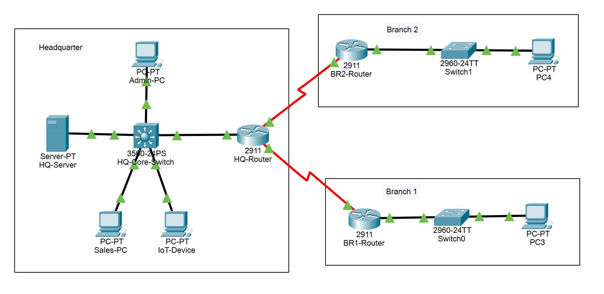
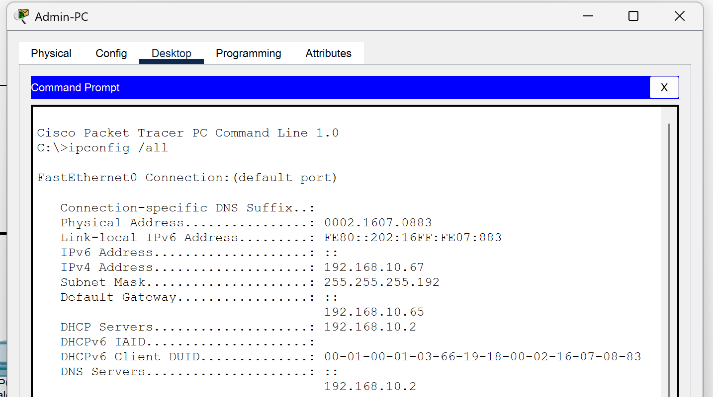
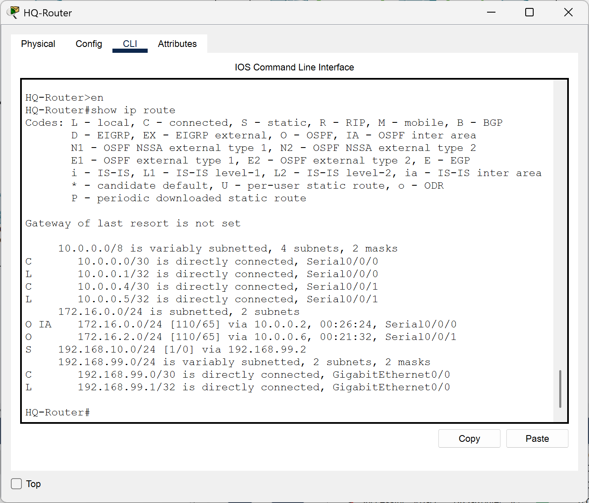
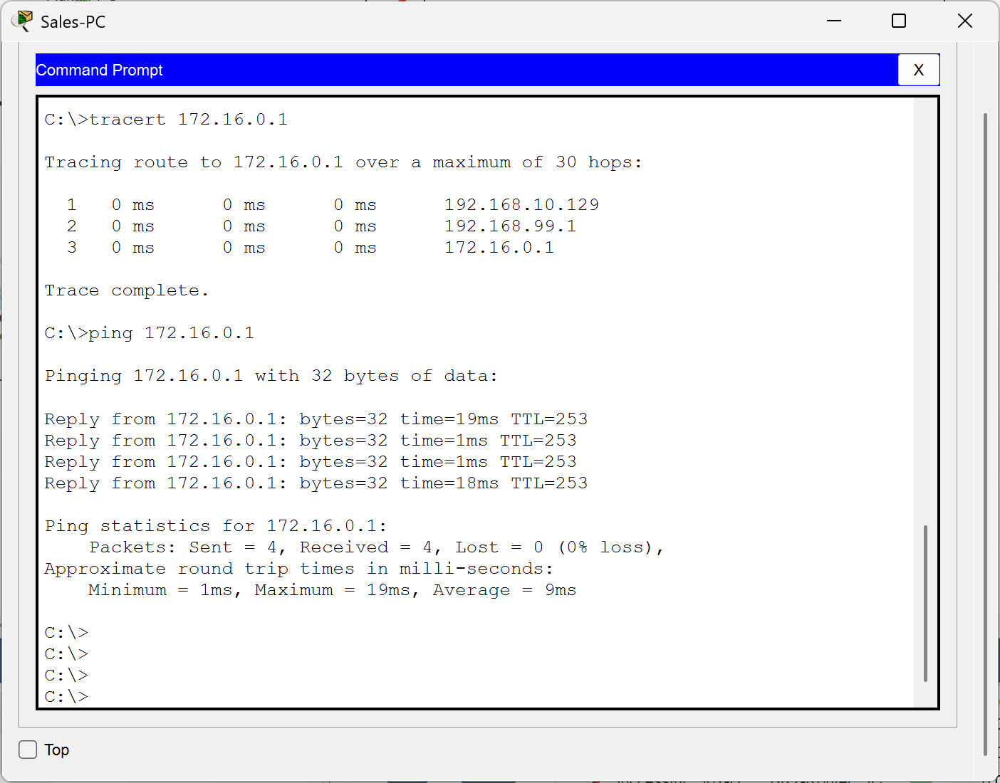

# **Project Report: Design and Implementation of an Enterprise LAN/WAN with VLSM, Supernetting, and Core Network Services**

### **1. Abstract**

This project presents the comprehensive design and simulation of a multi-site enterprise network using Cisco Packet Tracer. The primary objective was to emulate a scalable, real-world corporate infrastructure that integrates Headquarters (HQ) and remote Branch offices. The network architecture employs Variable Length Subnet Masking (VLSM) to optimize IP address allocation across distinct departments (Admin, Sales, IoT, Servers) and Route Summarization (Supernetting) to minimize routing table overhead.

Core network services were implemented to ensure automation and ease of use. A centralized DHCP server at HQ manages dynamic addressing for internal VLANs, while Branch routers handle local address assignment. Domain Name System (DNS) services were deployed to facilitate internal hostname resolution. Connectivity between sites is achieved through a hybrid routing strategy using OSPF (Open Shortest Path First) for dynamic WAN routing and static routing for internal LAN traffic. The simulation successfully demonstrated end-to-end connectivity, efficient route propagation through aggregation, and the functional deployment of network application services, fulfilling all design requirements for a robust enterprise network.

### **2. Introduction**

In the modern digital landscape, enterprise networks act as the backbone of organizational operations, requiring designs that are not only robust but also scalable and efficient. As organizations expand geographically, connecting headquarters with branch offices introduces complexities related to IP addressing, routing efficiency, and service management. This project focuses on solving these challenges through advanced networking techniques.

The project simulates a multi-site organization consisting of a main Headquarters and two Branch offices. A key focus is placed on **IP efficiency**; VLSM is utilized to reduce address wastage by sizing subnets according to actual need, rather than default class boundaries. Furthermore, **Route Aggregation (Supernetting)** is introduced to optimize router performance. By summarizing multiple contiguous subnet routes into a single advertisement, the processing load on core routers is significantly reduced. Additionally, the project integrates critical application layer services—specifically DHCP for automated IP management and DNS for name resolution—ensuring that the network is user-friendly. This simulation serves as a practical demonstration of how varied networking protocols (OSPF, VLANs, DHCP, DNS) function cohesively to support enterprise data flow.

### **3. Problem Statement**

The scenario presented involves a growing Multi-Site Organization that requires a unified network infrastructure connecting its Headquarters (HQ) with two remote Branch offices. The organization faces specific technical challenges that a standard flat network design cannot resolve.

First, the HQ contains multiple distinct departments (Servers, Admin, Sales, IoT) that require logical separation for security and traffic management, necessitating the use of Virtual Local Area Networks (VLANs). However, standard Class C addressing would lead to rapid IP exhaustion; therefore, an addressing scheme using **VLSM** is required to allocate IPs efficiently based on host counts.

Second, as the number of branch subnets grows, the routing tables on the HQ routers risk becoming bloated and inefficient. The network design must implement **Supernetting (Route Summarization)** to aggregate branch routes before they are advertised to HQ.

Third, manual configuration of end devices is unscalable. The solution must implement **DHCP** for dynamic host addressing across all sites and **DNS** for internal name resolution. Finally, the connection between sites must be fault-tolerant and dynamic, requiring the implementation of the **OSPF** routing protocol to manage WAN links effectively.

### **4. Methodology**

The project was implemented using **Cisco Packet Tracer** to simulate the hardware and software configuration. The design follows a Hub-and-Spoke topology, with the HQ acting as the central hub and branches as spokes connected via Serial WAN links.

**IP Addressing & Topology:**
The HQ network (192.168.10.0/24) was subnetted using VLSM into four /26 subnets to accommodate VLANs 10, 20, 30, and 40. A Multilayer Switch was configured for **Inter-VLAN routing** and acted as the gateway for local devices. Branch offices were assigned the 172.16.x.x range. Branch 1 was configured with a loopback interface to simulate multiple networks, which were then summarized into a single /23 supernet advertisement using OSPF.

**Configuration Strategy:**

* **Switching:** VLANs were created on the HQ Core Switch. `ip helper-address` was configured on Switch Virtual Interfaces (SVIs) to relay DHCP requests to the central server.
* **Routing:** OSPF Area 0 was established for the backbone (WAN links), while Branch LANs were placed in Area 1. The `area range` command was utilized on Branch 1 to enforce supernetting. Static routes were used at HQ to direct traffic from the edge router to the internal LAN, and these were redistributed into OSPF.
* **Services:** The HQ Server was configured with BIND-like DNS services and multiple DHCP pools corresponding to the VLAN gateways.

### **5. Result and Interpretation**

The simulation successfully met all project objectives. The following screenshots verify the functionality of the network:

**Figure 1: Network Topology**

*Interpretation: This detailed diagram shows the Hub-and-Spoke architecture, with the HQ Router connecting to two Branch routers via Serial links, and the HQ internal LAN segmented by the Multilayer Switch.*

**Figure 2: DHCP and DNS Verification**

*Interpretation: The output confirms that the PC automatically received an IP address (e.g., 192.168.10.66) from the DHCP server. The DNS server entry (192.168.10.2) is also correctly populated, proving the `ip helper-address` configuration is functional.*

**Figure 3: Route Summarization (Supernetting)**

*Interpretation: The routing table displays a single entry for `172.16.0.0/23` pointing to Branch 1. It does not show individual /24 subnets. This confirms that route aggregation is working, reducing the routing table size.*

**Figure 4: End-to-End Connectivity**

*Interpretation: The successful ping replies demonstrate that OSPF is correctly routing traffic across the WAN and that the redistribution of static routes at HQ allows return traffic to reach the internal VLANs.*

### **6. Conclusion**

This project successfully demonstrated the design and implementation of a scalable enterprise network integrating LAN and WAN technologies. By utilizing **VLSM**, the IP addressing scheme was optimized to support multiple departments without wasting address space. The implementation of **OSPF with Route Summarization** proved effective in maintaining a concise routing table at the Headquarters, ensuring the network remains scalable even if the branch offices expand their subnets in the future.

Furthermore, the integration of **DHCP and DNS** services highlighted the importance of network automation, significantly reducing the administrative burden of manual device configuration. The successful connectivity tests and routing verification confirm that the network is robust, logically segmented, and ready for real-world application. The project outcomes emphasize that a combination of efficient addressing, dynamic routing, and centralized services is essential for modern enterprise infrastructure.

### **7. References**

1. CompTIA Network+ N10-008 Certification Guide by Glen D. Singh, 2nd Edition, Packt publication.
2. W. Odom, *CCNA Routing and Switching 200-125 Official Cert Guide Library*. Cisco Press, 2016.
3. J. F. Kurose and K. W. Ross, *Computer Networking: A Top-Down Approach*, 7th ed. Pearson, 2017.
4. T. Lammle, *CCNA Routing and Switching Complete Study Guide: Exam 100-105, Exam 200-105, Exam 200-125*. Sybex, 2016.
5. Cisco Systems, "OSPF Design Guide," *Cisco.com*. [Online]. Available: [https://www.cisco.com/c/en/us/support/docs/ip/open-shortest-path-first-ospf/7039-1.html](https://www.cisco.com/c/en/us/support/docs/ip/open-shortest-path-first-ospf/7039-1.html).
